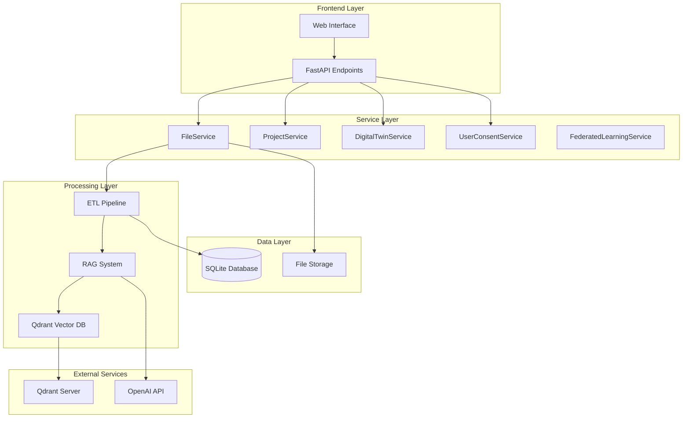
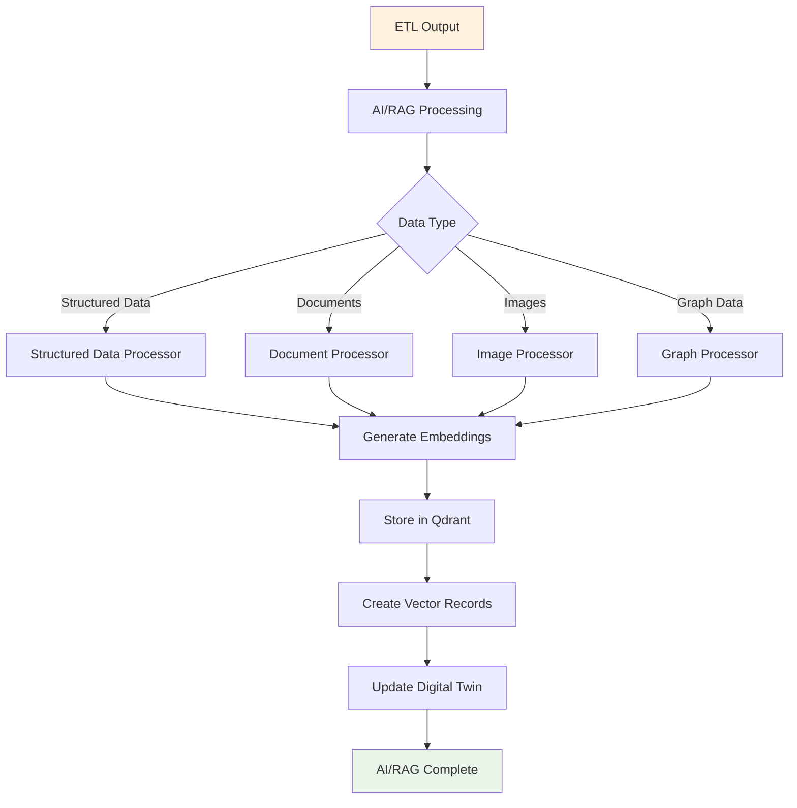
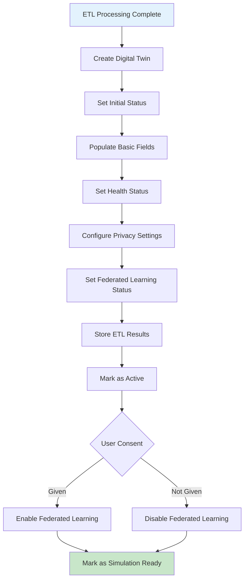
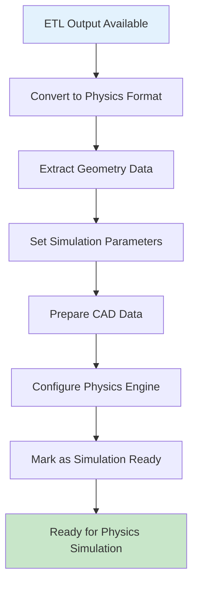
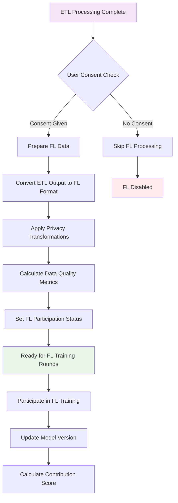
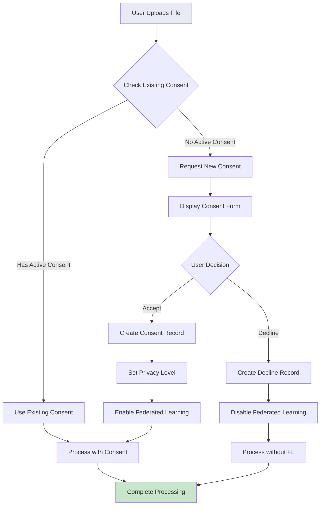

# AASX Module - Comprehensive Framework Guide

## 📋 Table of Contents
1. [Overview](#overview)
2. [AASX File Format](#aasx-file-format)
3. [Framework Architecture](#framework-architecture)
4. [AASX Processing Flow](#aasx-processing-flow)
5. [ETL Pipeline](#etl-pipeline)
6. [AI/RAG Integration](#airag-integration)
7. [Digital Twin Creation](#digital-twin-creation)
8. [Federated Learning Integration](#federated-learning-integration)
9. [User Consent Management](#user-consent-management)
10. [API Endpoints](#api-endpoints)
11. [Configuration](#configuration)
12. [Troubleshooting](#troubleshooting)

---

## 🎯 Overview

The AASX (Asset Administration Shell XML) Module is the core component of the Digital Twin Analytics Framework. It processes AASX files containing digital twin information and triggers a comprehensive pipeline that includes ETL processing, AI/RAG analysis, digital twin creation, and federated learning integration.

### Key Features
- **Multi-format AASX Processing**: Handles various AASX file formats and structures
- **Intelligent ETL Pipeline**: Extracts, transforms, and loads structured and unstructured data
- **AI/RAG Integration**: Advanced AI analysis with vector database storage
- **Digital Twin Management**: Complete lifecycle management of digital twins
- **Federated Learning**: Privacy-preserving distributed machine learning
- **User Consent Management**: GDPR-compliant consent tracking
- **Real-time Processing**: Asynchronous processing with progress tracking

---

## 📄 AASX File Format

### What is AASX?
AASX (Asset Administration Shell XML) is a standardized format for representing digital twins in Industry 4.0 environments. It contains:

- **Asset Information**: Physical asset descriptions and properties
- **Submodels**: Structured data about specific aspects of the asset
- **Documents**: Related documentation, manuals, and specifications
- **Images**: Visual representations and diagrams
- **Metadata**: Administrative and technical metadata

### AASX Structure
```xml
<?xml version="1.0" encoding="UTF-8"?>
<aasx:aasx xmlns:aasx="http://www.admin-shell.io/aasx/1.0">
  <aasx:sourceDocument>
    <aas:assetAdministrationShell>
      <aas:id>asset_id</aas:id>
      <aas:assetInformation>
        <!-- Asset details -->
      </aas:assetInformation>
      <aas:submodels>
        <!-- Submodel references -->
      </aas:submodels>
    </aas:assetAdministrationShell>
  </aasx:sourceDocument>
  <aasx:submodels>
    <!-- Submodel definitions -->
  </aasx:submodels>
  <aasx:files>
    <!-- Related files and documents -->
  </aasx:files>
</aasx:aasx>
```

---

## 🏗️ Framework Architecture



### Database Schema

The framework uses a comprehensive SQLite database with the following key tables:

#### **Core Tables**
- **`files`**: File management with federated learning support
- **`projects`**: Project organization and metadata
- **`use_cases`**: Use case categorization
- **`digital_twins`**: Digital twin lifecycle management
- **`users`**: User management and authentication
- **`organizations`**: Organization structure

#### **New Tables (Recent Additions)**
- **`user_consents`**: GDPR-compliant consent tracking for federated learning

#### **Key Schema Changes**
- **`files.federated_learning`**: New column to track federated learning participation status
- **`user_consents`**: Complete table for consent management with privacy controls

---

## 🔄 AASX Processing Flow

```mermaid
flowchart TD
    A[AASX File Upload] --> B{File Validation}
    B -->|Valid| C[Store File]
    B -->|Invalid| D[Return Error]
    
    C --> E[Create File Record]
    E --> F[Trigger ETL Pipeline]
    
    F --> G[Import aasx_processor]
    G --> H[Call extract_aasx()]
    H --> I[Extract JSON/Graph/RDF/YAML]
    
    I --> J[Update File Status]
    J --> K[Create Digital Twin]
    
    K --> L{User Consent Check}
    L -->|Consent Given| M[Enable Federated Learning]
    L -->|No Consent| N[Disable Federated Learning]
    
    M --> O[AI/RAG Processing]
    N --> O
    O --> P[Generate Embeddings]
    P --> Q[Store in Qdrant]
    Q --> R[Mark as Simulation Ready]
    
    R --> S[Complete Processing]
    
    style A fill:#e1f5fe
    style S fill:#c8e6c9
    style D fill:#ffcdd2
```

### Current Implementation
The framework uses the proven `aasx_processor` library for all AASX extraction work:
- **Simple Import**: `from src.aasx.aasx_processor import extract_aasx, batch_extract`
- **Direct Call**: `extract_aasx(file_path, output_dir, formats=['json', 'graph', 'rdf', 'yaml'])`
- **Automatic Extraction**: Handles XML parsing, submodel extraction, document processing, and image extraction
- **Multiple Formats**: Outputs structured data in JSON, Graph, RDF, and YAML formats

---

## ⚙️ ETL Pipeline

### AASX Processing Integration

The ETL pipeline uses the **aasx_processor** library to handle all AASX file processing. Our framework simply imports and orchestrates this external processor.

```mermaid
flowchart TD
    A[AASX File Upload] --> B[Import aasx_processor]
    B --> C[Call extract_aasx()]
    C --> D[Extract All Data Automatically]
    D --> E[Get Structured Output]
    E --> F[Process with AI/RAG]
    F --> G[Create Digital Twin]
    
    style A fill:#e1f5fe
    style D fill:#fff3e0
    style G fill:#c8e6c9
```

### What aasx_processor Extracts
The aasx_processor automatically extracts:
- **Asset Information**: Complete asset descriptions and properties
- **Submodels**: All structured data about asset aspects
- **Documents**: Related documentation, manuals, specifications
- **Images**: Visual representations, diagrams, schematics
- **Metadata**: Administrative and technical metadata
- **JSON Data**: Structured data in JSON format
- **Graph Data**: Relationship graphs and connections

### Framework Integration
```python
# Simple integration in our processor
from src.aasx.aasx_processor import extract_aasx

def process_single_file(self, file_path: Path, output_dir: Path, formats: List[str] = None):
    result = extract_aasx(file_path, output_dir, formats=['json', 'graph', 'rdf', 'yaml'])
    return result
```

### ETL Output Structure (from aasx_processor)
```
aasx_processor_output/
├── json_data/
│   ├── asset_info.json
│   ├── submodels.json
│   └── relationships.json
├── documents/
├── images/
├── graphs/
└── metadata.json
```

---

## 🤖 AI/RAG Integration

### AI/RAG Processing Flow



### AI/RAG Components
- **Text Embedding Manager**: Handles text embeddings using OpenAI or SentenceTransformers
- **Multimodal Embeddings**: Processes images, documents, and structured data
- **Vector Database**: Qdrant for storing and retrieving embeddings
- **RAG System**: Retrieval-Augmented Generation for intelligent responses
- **Context Retrieval**: Semantic and hybrid search capabilities

---

## 🏗️ Digital Twin Creation

### Digital Twin Lifecycle



### Current Implementation
The framework creates digital twins with ETL results and sets simulation readiness:

```python
def mark_simulation_ready(self, twin_id: str) -> bool:
    """Mark digital twin as ready for physics simulation"""
    success = self.digital_twin_service.update_simulation_status(twin_id, 'ready')
    return success
```

### Future Physics Modeling Readiness
**Intention**: After successful ETL processing, the extracted data will be prepared for physics simulation engines.



### Planned Physics Features
- **Data Conversion**: Convert ETL JSON/Graph data to physics simulation formats
- **Geometry Extraction**: Extract CAD and geometric data for simulation
- **Parameter Setup**: Configure simulation parameters from extracted metadata
- **Engine Integration**: Prepare data for various physics engines (FEM, CFD, etc.)
- **Simulation Tracking**: Monitor and record simulation runs and results

### Digital Twin Fields
The digital twin contains 25+ fields organized into categories:

#### **Basic Information**
- `twin_id`: Unique identifier (same as file_id)
- `twin_name`: Human-readable name
- `file_id`: Associated file reference
- `project_id`: Project association
- `status`: Current status (active, inactive, error)

#### **Health Monitoring**
- `health_status`: Current health state
- `health_score`: Numerical health score (0-100)
- `last_health_check`: Timestamp of last check
- `error_count`: Number of errors encountered
- `maintenance_required`: Boolean flag

#### **Physics Modeling**
- `extracted_data_path`: Path to ETL output
- `physics_context`: JSON physics parameters
- `simulation_history`: Array of simulation runs
- `simulation_status`: Current simulation state
- `model_version`: Version of physics model

#### **Federated Learning**
- `federated_participation_status`: Participation state
- `federated_node_id`: FL node identifier
- `federated_model_version`: FL model version
- `federated_contribution_score`: Data quality score
- `federated_health_status`: FL health state

#### **Privacy & Security**
- `data_privacy_level`: Privacy setting (private, shared, public)
- `data_sharing_permissions`: Consent permissions
- `differential_privacy_epsilon`: Privacy parameter
- `secure_aggregation_enabled`: Security flag

### File Model Fields
The file model includes federated learning support:

#### **Core File Information**
- `file_id`: Unique file identifier
- `filename`: Processed filename
- `original_filename`: Original uploaded filename
- `project_id`: Associated project
- `filepath`: File storage path
- `size`: File size in bytes
- `status`: Processing status (not_processed, processing, processed, failed)

#### **Federated Learning Support**
- `federated_learning`: Participation status ("allowed", "not_allowed", "conditional")

### User Consent Model Fields
The user consent model provides GDPR-compliant consent tracking:

#### **Consent Information**
- `consent_id`: Unique consent identifier
- `user_id`: User who gave consent
- `consent_type`: Type of consent (federated_learning, data_sharing, analytics, research)
- `consent_given`: Boolean consent status
- `consent_timestamp`: When consent was given

#### **Privacy & Compliance**
- `data_privacy_level`: Privacy setting (private, shared, public)
- `consent_terms_version`: Version of consent terms
- `consent_terms`: Full consent terms text
- `metadata`: Additional consent metadata (JSON)

#### **Entity Associations**
- `project_id`: Associated project (optional)
- `file_id`: Associated file (optional)

---

## 🔗 Federated Learning Integration

### Current Implementation
The framework currently sets up federated learning participation status based on user consent:

```python
def update_federated_learning_step(self, twin_result: Dict[str, Any], config: Dict[str, Any]):
    user_consent = config.get('user_consent', False)
    if user_consent:
        self.federated_learning_service.update_federated_participation(twin_id, 'active')
    else:
        self.federated_learning_service.update_federated_participation(twin_id, 'inactive')
```

### Future Federated Learning Readiness
**Intention**: After successful ETL processing, the extracted data will be prepared for federated learning participation.



### Planned FL Features
- **Data Preparation**: Convert ETL output to FL-compatible training data
- **Privacy-Preserving**: Apply differential privacy and secure aggregation
- **Quality Scoring**: Evaluate data contribution quality for FL rounds
- **Model Synchronization**: Keep local and global models in sync
- **Health Monitoring**: Track FL participation health and performance

---

## 👤 User Consent Management

### Consent Management Flow



### Consent Types
- **Federated Learning**: Consent for distributed machine learning
- **Data Sharing**: Consent for data sharing with other nodes
- **Analytics**: Consent for analytics processing
- **Research**: Consent for research purposes

### Privacy Levels
- **Private**: Data stays local, no sharing
- **Shared**: Data shared with consent
- **Public**: Data available for public use

---

## 🔌 API Endpoints

### File Management
```http
POST /projects/{project_id}/upload
GET /projects/{project_id}/files
GET /files/{file_id}
DELETE /files/{file_id}
```

### ETL Processing
```http
POST /files/{file_id}/process
GET /files/{file_id}/status
GET /files/{file_id}/results
```

### Digital Twin Management
```http
GET /digital-twins
GET /digital-twins/{twin_id}
PUT /digital-twins/{twin_id}
DELETE /digital-twins/{twin_id}
```

### User Consent
```http
POST /consent
GET /consent/{user_id}
PUT /consent/{consent_id}
DELETE /consent/{consent_id}
```

### Federated Learning
```http
GET /federated-learning/status
POST /federated-learning/participate
GET /federated-learning/statistics
```

---

## ⚙️ Configuration

### Environment Variables
```bash
# Database Configuration
DATABASE_PATH=data/aasx_database.db

# AI/RAG Configuration
OPENAI_API_KEY=your_openai_api_key
TEXT_EMBEDDING_PROVIDER=openai
TEXT_EMBEDDING_MODEL=text-embedding-ada-002

# Vector Database Configuration
QDRANT_HOST=localhost
QDRANT_PORT=6333

# File Storage Configuration
UPLOAD_DIR=data/uploads
MAX_FILE_SIZE=100MB
ALLOWED_EXTENSIONS=.aasx,.xml

# Privacy Configuration
DEFAULT_PRIVACY_LEVEL=private
CONSENT_EXPIRY_DAYS=365
```

### Configuration Files
- `local.env`: Local environment configuration
- `src/ai_rag/config/embedding_config.py`: AI/RAG configuration
- `webapp/config/settings.py`: Web application settings

---

## 🔧 Troubleshooting

### Common Issues

#### File Upload Issues
```bash
# Check file permissions
ls -la data/uploads/

# Check disk space
df -h

# Check file size limits
python -c "import os; print(os.getenv('MAX_FILE_SIZE'))"
```

#### ETL Processing Issues
```bash
# Check ETL logs
tail -f logs/etl.log

# Verify file structure
python scripts/verify_file_structure.py

# Test ETL pipeline
python scripts/test_etl_pipeline.py
```

#### AI/RAG Issues
```bash
# Check OpenAI API key
python -c "import os; print('API Key:', 'Set' if os.getenv('OPENAI_API_KEY') else 'Not Set')"

# Test Qdrant connection
python scripts/test_qdrant_connection.py

# Verify embeddings
python scripts/test_embeddings.py
```

#### Database Issues
```bash
# Check database integrity
python scripts/verify_database.py

# Check migrations
python scripts/verify_migrations.py

# Verify new schema changes
python scripts/verify_migrations.py

# Backup database
cp data/aasx_database.db data/backup_$(date +%Y%m%d_%H%M%S).db
```

#### User Consent Issues
```bash
# Check user consent table
python -c "
import sqlite3
conn = sqlite3.connect('data/aasx_database.db')
cursor = conn.cursor()
cursor.execute('SELECT COUNT(*) FROM user_consents')
print(f'User consents: {cursor.fetchone()[0]}')
conn.close()
"

# Check federated_learning column
python -c "
import sqlite3
conn = sqlite3.connect('data/aasx_database.db')
cursor = conn.cursor()
cursor.execute('PRAGMA table_info(files)')
columns = [col[1] for col in cursor.fetchall()]
print('federated_learning column exists:', 'federated_learning' in columns)
conn.close()
"
```

### Debug Mode
Enable debug mode for detailed logging:
```bash
export LOG_LEVEL=DEBUG
python main_local.py
```

---

## 📊 Performance Metrics

### Processing Times
- **File Upload**: 1-5 seconds
- **ETL Processing**: 30-120 seconds (depending on file size)
- **AI/RAG Processing**: 60-300 seconds
- **Digital Twin Creation**: 5-10 seconds
- **Federated Learning Setup**: 10-30 seconds

### Resource Usage
- **Memory**: 512MB - 2GB (depending on file size)
- **CPU**: 2-4 cores during processing
- **Storage**: 2-10x original file size
- **Network**: Minimal (local processing)

---

## 🔮 Future Enhancements

### Planned Features
1. **Real-time Processing**: WebSocket-based real-time updates
2. **Batch Processing**: Support for multiple file uploads
3. **Advanced Analytics**: Machine learning insights
4. **Cloud Integration**: AWS/Azure cloud storage
5. **Mobile Support**: Mobile application interface
6. **Advanced Security**: End-to-end encryption
7. **Performance Optimization**: Parallel processing
8. **API Versioning**: Versioned API endpoints

### Roadmap
- **Q1 2025**: Real-time processing and batch uploads
- **Q2 2025**: Cloud integration and mobile support
- **Q3 2025**: Advanced analytics and ML insights
- **Q4 2025**: Performance optimization and security enhancements

---

## 📚 Additional Resources

### Documentation
- [AASX Specification](https://www.plattform-i40.de/PI40/Redaktion/EN/Downloads/Publikation/Details_of_the_Asset_Administration_Shell_Part_1_V3.html)
- [Digital Twin Framework](https://www.iso.org/standard/75066.html)
- [Federated Learning Guide](https://ai.googleblog.com/2017/04/federated-learning-collaborative.html)

### Code Examples
- [ETL Pipeline Example](examples/etl_pipeline_example.py)
- [Digital Twin Creation](examples/digital_twin_example.py)
- [Federated Learning Setup](examples/federated_learning_example.py)

### Support
- **Issues**: [GitHub Issues](https://github.com/your-repo/issues)
- **Documentation**: [Wiki](https://github.com/your-repo/wiki)
- **Discussions**: [GitHub Discussions](https://github.com/your-repo/discussions)

---

*Last Updated: January 2025*  
*Version: 1.0.0* 