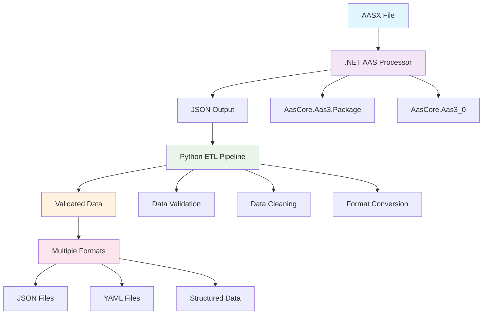
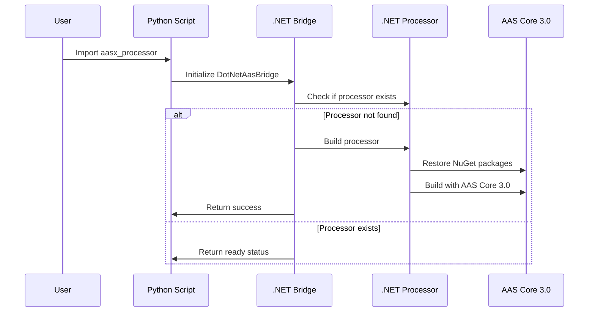
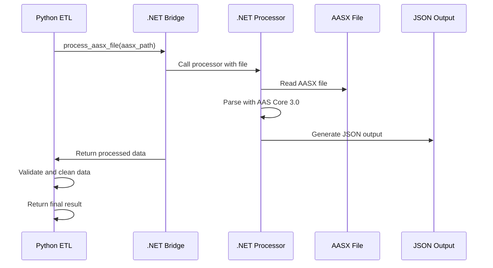
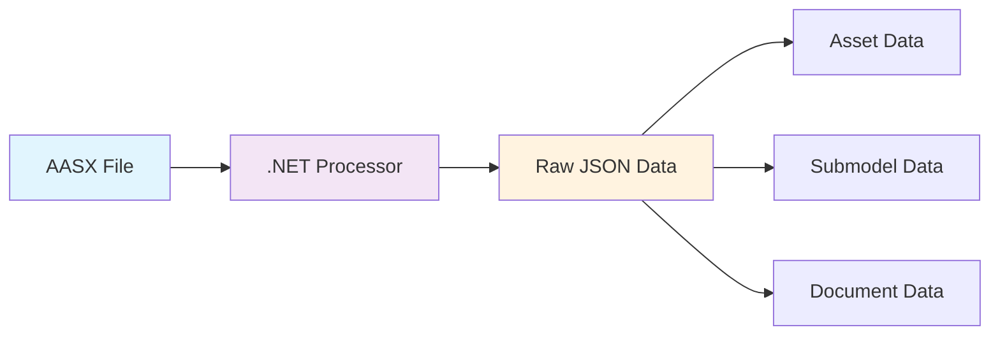
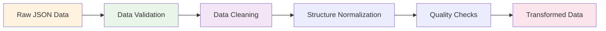
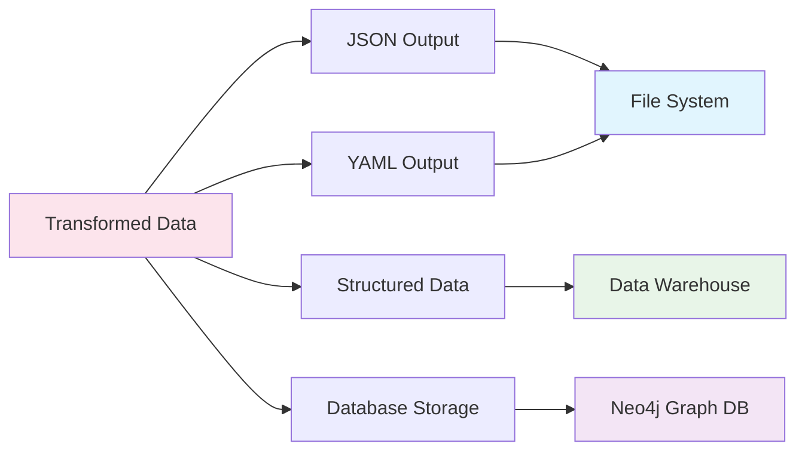
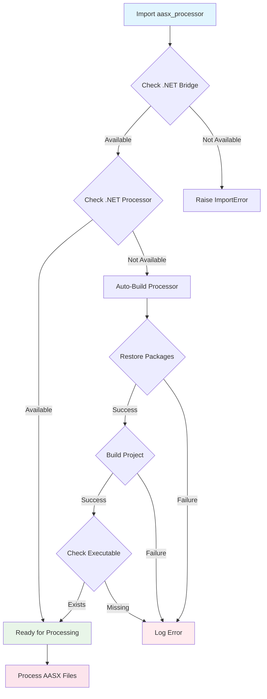
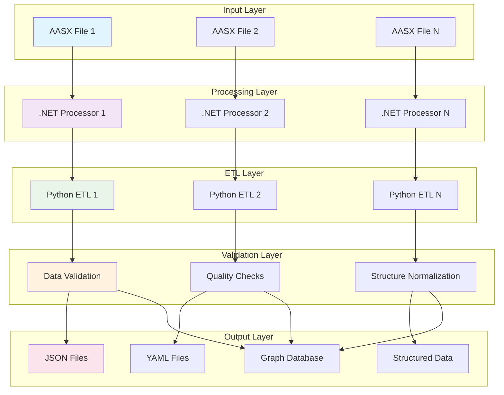
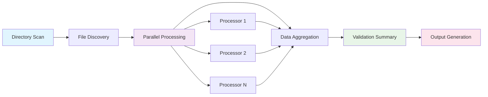

# AASX Processing Architecture & ETL Pipeline

## 📋 Table of Contents

1. [Overview](#overview)
2. [Architecture Overview](#architecture-overview)
3. [Detailed Chain Process](#detailed-chain-process)
4. [ETL Pipeline Stages](#etl-pipeline-stages)
5. [Component Details](#component-details)
6. [Auto-Setup Process](#auto-setup-process)
7. [Data Flow Diagrams](#data-flow-diagrams)
8. [Usage Examples](#usage-examples)
9. [Troubleshooting](#troubleshooting)

## 🎯 Overview

The AASX Processing Architecture provides a robust solution for processing Asset Administration Shell Exchange (AASX) files using proper AAS Core 3.0 libraries. Since Python lacks official AAS libraries, we use a .NET-based processor with Python orchestration.

### Key Features
- ✅ **Proper AAS Processing**: Uses official AAS Core 3.0 libraries
- ✅ **Auto-Setup**: Automatically builds and configures .NET processor
- ✅ **Data Validation**: Ensures AAS specification compliance
- ✅ **ETL Pipeline**: Complete extraction, transformation, and loading
- ✅ **Multiple Output Formats**: JSON, YAML, and structured data

## 🏗️ Architecture Overview



## 🔄 Detailed Chain Process

### Phase 1: .NET Processor Setup


### Phase 2: AASX Processing


## 🔧 ETL Pipeline Stages

### 1. Extraction Stage


**Process:**
- AASX file is read by .NET processor
- AAS Core 3.0 libraries parse the file structure
- Raw JSON data is extracted with proper AAS semantics
- Data includes assets, submodels, and documents

### 2. Transformation Stage


**Process:**
- **Validation**: Check AAS specification compliance
- **Cleaning**: Remove null/invalid entries
- **Normalization**: Standardize data structure
- **Quality Checks**: Ensure data integrity

### 3. Loading Stage


**Process:**
- **JSON Output**: Human-readable structured data
- **YAML Output**: Configuration-friendly format
- **Structured Data**: Database-ready format
- **Graph Storage**: Neo4j for relationship analysis

## 🧩 Component Details

### 1. .NET AAS Processor (`aas-processor/`)

**Purpose**: Core AASX processing engine
**Language**: C# (.NET 6.0)
**Dependencies**:
```xml
<PackageReference Include="AasCore.Aas3.Package" Version="1.0.2" />
<PackageReference Include="AasCore.Aas3_0" Version="1.0.4" />
```

**Key Features**:
- Proper AASX file parsing
- XML and JSON content extraction
- AAS Core 3.0 specification compliance
- Error handling and validation

### 2. Python Bridge (`src/aasx/dotnet_bridge.py`)

**Purpose**: Python interface to .NET processor
**Key Functions**:
```python
class DotNetAasBridge:
    def __init__(self, dotnet_project_path: str = "aas-processor")
    def _build_processor(self) -> bool
    def process_aasx_file(self, aasx_file_path: str) -> Optional[Dict[str, Any]]
    def is_available(self) -> bool
```

### 3. Python ETL Pipeline (`src/aasx/aasx_processor.py`)

**Purpose**: Complete ETL orchestration
**Key Classes**:
```python
class AASXProcessor:
    def __init__(self, aasx_file_path: str)
    def ensure_processor_ready(self) -> bool
    def process(self) -> Dict[str, Any]
    def _validate_and_clean_result(self, result: Dict[str, Any]) -> Dict[str, Any]

class AASXBatchProcessor:
    def process_all(self) -> Dict[str, Any]
```

## 🤖 Auto-Setup Process



**Auto-Setup Features**:
- ✅ Automatic .NET processor building
- ✅ NuGet package restoration
- ✅ Executable verification
- ✅ Error handling and logging
- ✅ Idempotent operations

## 📊 Data Flow Diagrams

### Complete Data Flow


### Batch Processing Flow


## 💻 Usage Examples

### Basic Usage
```python
from aasx.aasx_processor import AASXProcessor

# Auto-setup happens automatically
processor = AASXProcessor("path/to/file.aasx")
result = processor.process()

print(f"Assets: {len(result['assets'])}")
print(f"Submodels: {len(result['submodels'])}")
```

### Batch Processing
```python
from aasx.aasx_processor import AASXBatchProcessor

batch_processor = AASXBatchProcessor("path/to/aasx/directory")
results = batch_processor.process_all()

print(f"Processed: {results['successful_processing']} files")
print(f"Failed: {results['failed_processing']} files")
```

### Manual Setup
```python
from aasx.aasx_processor import auto_setup_dotnet_processor

# Manual setup if needed
if auto_setup_dotnet_processor():
    print("✅ .NET processor ready")
else:
    print("❌ Setup failed")
```

## 🔧 Troubleshooting

### Common Issues

#### 1. .NET Processor Build Failure
**Symptoms**: `Failed to build .NET project`
**Solutions**:
- Ensure .NET 6.0 SDK is installed
- Check NuGet package availability
- Verify project structure

#### 2. AASX Processing Errors
**Symptoms**: `Invalid result from .NET processor`
**Solutions**:
- Verify AASX file integrity
- Check file permissions
- Validate AASX format

#### 3. Import Errors
**Symptoms**: `DotNet bridge not available`
**Solutions**:
- Check Python path configuration
- Verify module structure
- Ensure auto-setup is working

### Debug Mode
```python
import logging
logging.basicConfig(level=logging.DEBUG)

# This will show detailed setup and processing logs
from aasx.aasx_processor import AASXProcessor
```

## 📈 Performance Considerations

### Optimization Strategies
1. **Parallel Processing**: Batch processor uses multiple threads
2. **Caching**: Built processor is reused
3. **Memory Management**: Efficient data structures
4. **Error Recovery**: Graceful failure handling

### Scalability
- ✅ **Horizontal**: Multiple processors
- ✅ **Vertical**: Optimized single processor
- ✅ **Batch**: Efficient bulk processing
- ✅ **Streaming**: Large file handling

## 🔮 Future Enhancements

### Planned Features
- [ ] **Web API**: RESTful interface
- [ ] **Real-time Processing**: Streaming capabilities
- [ ] **Advanced Validation**: Custom validation rules
- [ ] **Plugin System**: Extensible processing
- [ ] **Cloud Integration**: AWS/Azure support

### Architecture Evolution
- [ ] **Microservices**: Distributed processing
- [ ] **Event-Driven**: Message-based architecture
- [ ] **Containerization**: Docker deployment
- [ ] **Monitoring**: Performance metrics

---

## 📚 Additional Resources

- [AAS Core 3.0 Specification](https://www.plattform-i40.de/PI40/Redaktion/EN/Downloads/Publikation/Details_of_the_Asset_Administration_Shell_Part1_V3.html)
- [.NET AAS Libraries](https://www.nuget.org/packages/AasCore.Aas3.Package/)
- [AASX Package Format](https://www.plattform-i40.de/PI40/Redaktion/EN/Downloads/Publikation/Details_of_the_Asset_Administration_Shell_Part2_V3.html)

---

*This architecture ensures proper AASX processing using official AAS Core 3.0 libraries while providing a user-friendly Python interface with automatic setup capabilities.* 