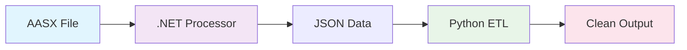
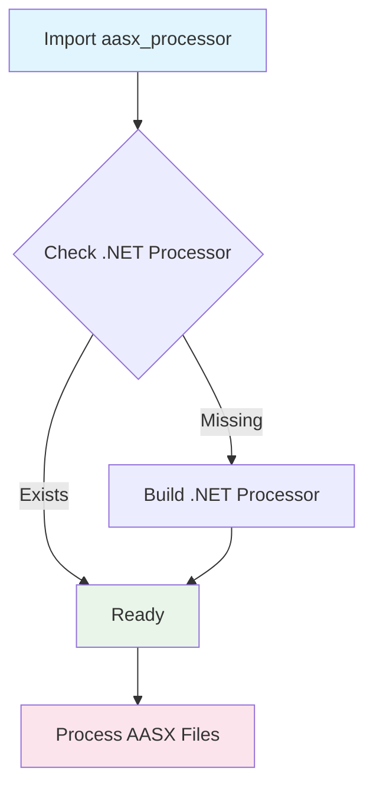
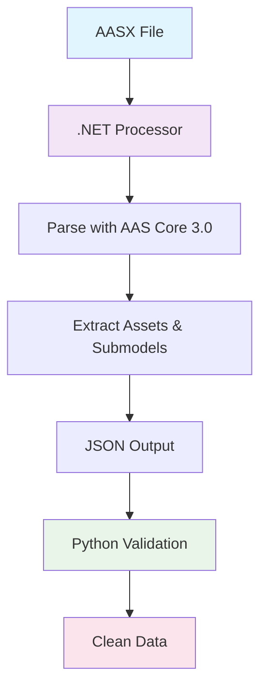

# AASX Processing Quick Guide

## 🎯 Quick Overview

```
AASX File → .NET Processor → Python ETL → Clean Data
```

## 🔄 Simple Flow



## 🏗️ Architecture Components

### 1. .NET AAS Processor
- **What**: C# program that reads AASX files
- **Uses**: Official AAS Core 3.0 libraries
- **Output**: JSON with proper AAS data

### 2. Python Bridge
- **What**: Python code that calls .NET processor
- **Does**: Subprocess communication
- **Handles**: File I/O and data transfer

### 3. Python ETL Pipeline
- **What**: Main processing orchestration
- **Does**: Data validation, cleaning, formatting
- **Output**: Multiple formats (JSON, YAML, etc.)

## 🚀 How It Works

### Step 1: Auto-Setup


### Step 2: Processing


## 💻 Usage

### Basic Usage
```python
from aasx.aasx_processor import AASXProcessor

# Auto-setup happens automatically
processor = AASXProcessor("file.aasx")
result = processor.process()
```

### What Happens
1. ✅ **Auto-setup**: Builds .NET processor if needed
2. ✅ **Processing**: Uses .NET processor to read AASX
3. ✅ **Validation**: Ensures data quality
4. ✅ **Output**: Returns clean, structured data

## 🎯 Key Benefits

- ✅ **Proper AAS Processing**: Uses official libraries
- ✅ **Auto-Setup**: No manual configuration needed
- ✅ **Data Quality**: Validates against AAS specification
- ✅ **Multiple Formats**: JSON, YAML, structured data
- ✅ **Error Handling**: Robust failure recovery

## 🔧 Why This Architecture?

### Problem
- Python has no proper AAS libraries
- AASX files need official AAS Core 3.0 processing
- Manual setup is error-prone

### Solution
- .NET processor with official AAS libraries
- Python bridge for easy integration
- Auto-setup for user convenience

## 📊 Data Flow Summary

```
Input: AASX File
    ↓
.NET Processor (C# + AAS Core 3.0)
    ↓
JSON with AAS Data
    ↓
Python ETL Pipeline
    ↓
Validated & Clean Data
    ↓
Output: Multiple Formats
```

---

*This architecture ensures accurate AASX processing while providing a simple Python interface.* 