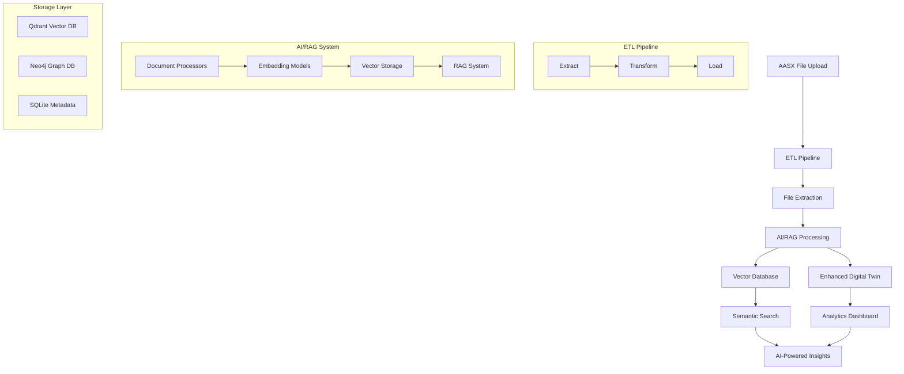
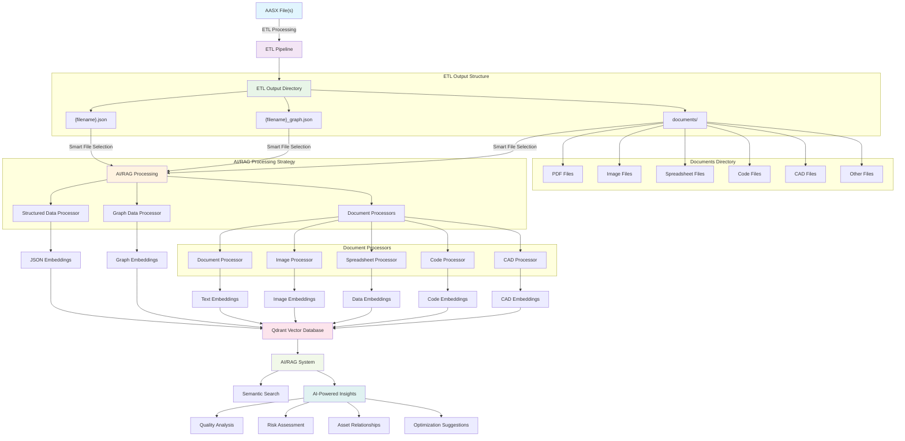
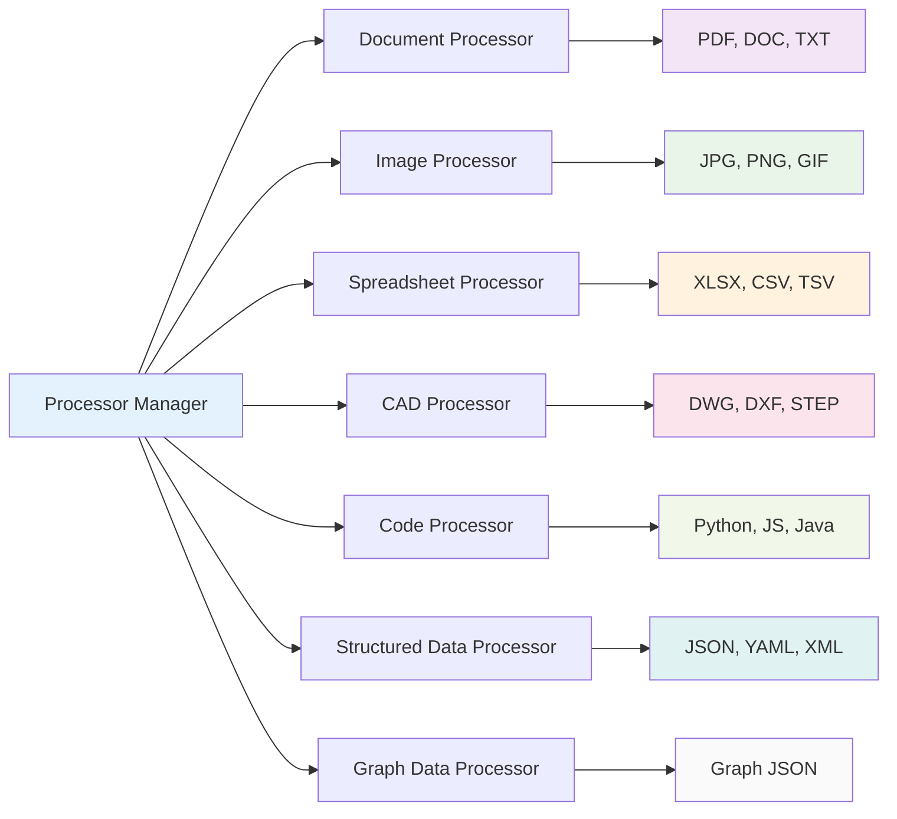
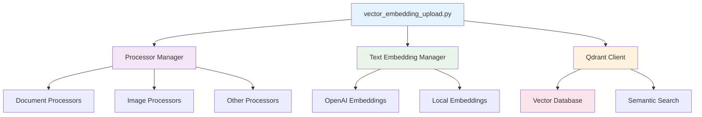
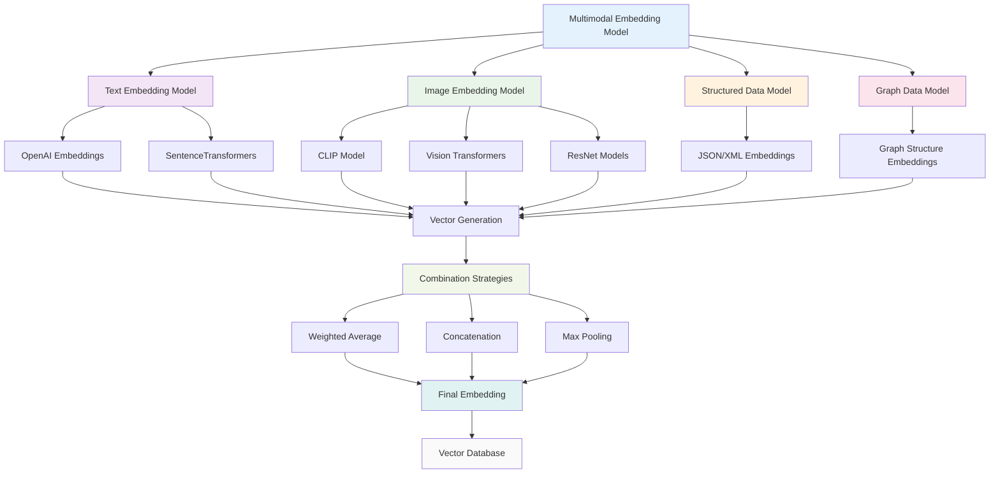
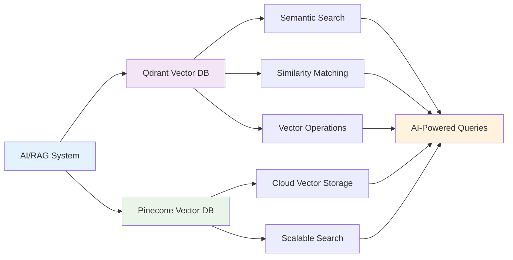
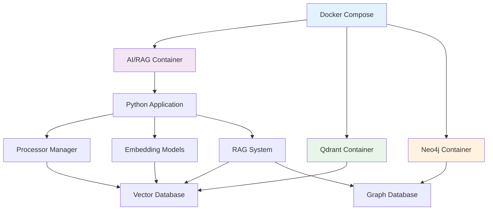

# AI/RAG Comprehensive Guide for AASX Digital Twin Analytics

## Overview

The AI/RAG (Artificial Intelligence/Retrieval-Augmented Generation) system is a comprehensive, modular solution designed to process and analyze diverse file types extracted from Asset Administrative Shell (AASX) files. This system enables intelligent content extraction, semantic analysis, vector embedding generation, and AI-powered insights for industrial asset management applications.

## 🎯 System Architecture

### High-Level Architecture



## 🔄 Complete AI/RAG Workflow

### Actual AASX Processing Flow

#### ETL Output Structure
After successful ETL processing, the system creates the following structure:

```
output/projects/{project_id}/{aasx_filename}/
├── {aasx_filename}.json          # Structured data (JSON)
├── {aasx_filename}_graph.json    # Graph data (JSON)
└── documents/                    # Documents directory
    ├── document1.pdf             # PDF files
    ├── document2.jpg             # Image files
    ├── spreadsheet.xlsx          # Spreadsheet files
    ├── code_file.py              # Code files
    ├── drawing.dwg               # CAD files
    └── ... (any file types extracted from AASX)
```

#### AI/RAG Processing Strategy
The AI/RAG system uses a smart file selection strategy in `src/ai_rag/etl_integration.py`:

1. **Structured Data**: Processes `{filename}.json` using `structured_data_processor.py`
2. **Graph Data**: Processes `{filename}_graph.json` using `graph_data_processor.py`
3. **Documents**: Processes all files in `documents/` directory using appropriate processors
4. **Smart Filtering**: Skips AASX metadata files (`.rels`, `[Content_Types].xml`)



## 🏗️ System Components

### 1. File Structure

The AI/RAG system is organized in `src/ai_rag/` with the following structure:

```
src/ai_rag/
├── __init__.py
├── etl_integration.py              # ETL pipeline integration
├── vector_embedding_upload.py      # Main vector embedding uploader
├── requirements.txt                # Core dependencies
├── requirements_processors.txt     # Processor-specific dependencies
├── processors/                     # Document processors
│   ├── __init__.py
│   ├── base_processor.py          # Base processor class
│   ├── processor_manager.py       # Processor orchestration
│   ├── document_processor.py      # PDF, DOC, TXT processing
│   ├── image_processor.py         # Image OCR and analysis
│   ├── code_processor.py          # Code file processing
│   ├── spreadsheet_processor.py   # Excel, CSV processing
│   ├── cad_processor.py           # CAD/technical drawing processing
│   ├── structured_data_processor.py  # JSON, YAML processing
│   └── graph_data_processor.py    # Graph-structured data
├── embedding_models/               # Embedding model implementations
├── vector_db/                      # Vector database clients
└── rag_system/                     # RAG system components
```

### 2. Existing Document Processors

The system includes specialized processors for different file types in `src/ai_rag/processors/`:



### 3. Core AI/RAG Components



### 4. Embedding Models

The `src/ai_rag/embedding_models/` directory contains specialized embedding models for different data types:

#### File Structure
```
src/ai_rag/embedding_models/
├── __init__.py
├── text_embeddings.py          # Text embedding models (OpenAI, SentenceTransformers)
├── image_embeddings.py         # Image embedding models (CLIP, Vision Transformers)
└── multimodal_embeddings.py    # Unified multimodal embedding system
```

#### Text Embedding Models (`text_embeddings.py`)
- **Providers**: OpenAI (`text-embedding-ada-002`) and SentenceTransformers
- **Features**: 
  - Text chunking for long documents
  - Batch processing for multiple texts
  - Automatic fallback between providers
  - Configurable embedding dimensions (1536 for OpenAI)
- **Use Cases**: Processing PDF text, code files, structured data, graph data

#### Image Embedding Models (`image_embeddings.py`)
- **Models**: CLIP, Vision Transformers, ResNet-based models
- **Features**:
  - Support for multiple image formats (JPG, PNG, GIF, etc.)
  - Automatic image preprocessing and resizing
  - GPU acceleration support
  - Metadata extraction (dimensions, format, file size)
- **Use Cases**: Processing CAD drawings, technical diagrams, photos

#### Multimodal Embedding Models (`multimodal_embeddings.py`)
- **Unified Interface**: Single model for text, images, structured data, and graphs
- **Combination Strategies**:
  - Weighted average of embeddings
  - Concatenation of embeddings
  - Max pooling of embeddings
- **Features**:
  - Automatic content type detection
  - Flexible embedding combination
  - Batch processing for mixed content
- **Use Cases**: Processing complex documents with mixed content types

#### How Embedding Models Work in AI/RAG Processing

The embedding models are used by the processors to convert different content types into vector representations:

1. **Text Processing**: 
   - `DocumentProcessor` → `TextEmbeddingModel` → Vector embeddings for PDF text, code comments, etc.
   - `CodeProcessor` → `TextEmbeddingModel` → Vector embeddings for code syntax and structure
   - `StructuredDataProcessor` → `TextEmbeddingModel` → Vector embeddings for JSON/XML content

2. **Image Processing**:
   - `ImageProcessor` → `ImageEmbeddingModel` → Vector embeddings for technical drawings, photos
   - `CADProcessor` → `ImageEmbeddingModel` → Vector embeddings for CAD file visualizations

3. **Mixed Content Processing**:
   - `MultimodalEmbeddingModel` → Combines text and image embeddings for complex documents
   - Used when documents contain both text and visual elements

4. **Graph Processing**:
   - `GraphDataProcessor` → `TextEmbeddingModel` → Vector embeddings for graph structure and relationships



### 5. Vector Database Integration



## 📁 Supported File Types

### Industrial & Technical Documents
- **CAD Files**: `.dwg`, `.dxf`, `.step`, `.stp`, `.iges`, `.stl`, `.obj`, `.svg`
- **Spreadsheets**: `.xlsx`, `.xls`, `.csv`, `.tsv`, `.ods`, `.xlsm`, `.xlsb`
- **Documents**: `.pdf`, `.docx`, `.doc`, `.txt`, `.rtf`, `.odt`
- **Images**: `.jpg`, `.jpeg`, `.png`, `.gif`, `.bmp`, `.tiff`, `.webp`

### Code & Configuration
- **Programming**: `.py`, `.js`, `.java`, `.cpp`, `.cs`, `.php`, `.rb`, `.go`
- **Web**: `.html`, `.css`, `.jsx`, `.tsx`, `.vue`, `.svelte`
- **Data**: `.sql`, `.json`, `.xml`, `.yaml`, `.yml`, `.toml`
- **Configuration**: `.ini`, `.cfg`, `.conf`, `.env`, `.properties`

### Structured Data
- **Graph Data**: `.json` (with graph structure detection)
- **Structured Data**: `.json`, `.yaml`, `.yml`, `.xml`, `.csv`

## 🚀 Quick Start

### Installation

1. **Install Python dependencies**:
```bash
pip install -r src/ai_rag/requirements.txt
pip install -r src/ai_rag/requirements_processors.txt
```

2. **Install system dependencies** (if needed):
```bash
# For OCR (Windows)
# Download and install Tesseract from: https://github.com/UB-Mannheim/tesseract/wiki

# For PDF processing
pip install PyPDF2 pdfplumber pymupdf

# For CAD processing
pip install ezdxf trimesh
```

### Basic Usage

```python
from src.ai_rag.vector_embedding_upload import VectorEmbeddingUploader

# Initialize the vector embedding uploader
uploader = VectorEmbeddingUploader()

# Process a single project
project_id = "project_123"
results = uploader.process_project(project_id)
print(f"Processing result: {results['status']}")

# Process all projects
all_results = uploader.process_all_projects()

# Search for similar content
similar_results = uploader.search_similar("quality control requirements", limit=10)
```

## 🔧 Configuration

### Environment Variables

Create a `.env` file with:

```env
# Vector Database
VECTOR_DB_HOST=localhost
VECTOR_DB_PORT=6333

# OpenAI (for embeddings)
OPENAI_API_KEY=your_openai_api_key

# Neo4j (for graph features)
NEO4J_URI=neo4j://localhost:7687
NEO4J_USER=neo4j
NEO4J_PASSWORD=your_neo4j_password

# Processing Configuration
AI_RAG_ENABLED=true
AI_RAG_MAX_FILES=100
AI_RAG_TIMEOUT=300

# Logging
LOG_LEVEL=INFO
ENVIRONMENT=development
```

### Processor Configuration

Each processor can be configured independently:

```python
# Custom processor configuration
processor_config = {
    "document_processor": {
        "max_file_size": "10MB",
        "ocr_enabled": True
    },
    "spreadsheet_processor": {
        "max_rows": 10000,
        "semantic_analysis": True
    },
    "cad_processor": {
        "extract_metadata": True,
        "analyze_dimensions": True
    }
}
```

## 🏭 Industrial Use Cases

### 1. Asset Documentation Processing

```python
# Process asset specification documents
asset_docs = [
    "motor_specs.pdf",      # Technical specifications
    "pump_drawings.dwg",    # CAD drawings
    "sensor_data.csv",      # Equipment data
    "control_logic.py"      # Control system code
]

# AI/RAG automatically processes all files and provides insights
# - Extracts technical specifications from PDFs
# - Analyzes CAD drawings for dimensions and materials
# - Mines spreadsheet data for equipment parameters
# - Understands control logic and functions
```

### 2. Technical Drawing Analysis

```python
# CAD files are automatically processed
cad_files = ["assembly.dxf", "part_drawing.step"]

# AI/RAG extracts:
# - Geometric information and dimensions
# - Material specifications
# - Layer and entity analysis
# - Engineering metadata
```

### 3. Spreadsheet Data Mining

```python
# Equipment specifications are analyzed
spec_sheets = ["equipment_list.xlsx", "maintenance_schedule.csv"]

# AI/RAG identifies:
# - Technical parameters (power, voltage, current)
# - Asset relationships and dependencies
# - Maintenance patterns and schedules
# - Performance metrics and specifications
```

## 📊 Processing Results

### AI/RAG Summary Example

```json
{
  "aasx_filename": "industrial_asset.aasx",
  "total_files_processed": 15,
  "successful_files": 14,
  "processor_breakdown": {
    "DocumentProcessor": 3,
    "SpreadsheetProcessor": 2,
    "CADProcessor": 1,
    "CodeProcessor": 2,
    "StructuredDataProcessor": 6
  },
  "content_type_breakdown": {
    "documents": 3,
    "spreadsheets": 2,
    "cad_files": 1,
    "code_files": 2,
    "structured_data": 6
  },
  "insights": [
    "Contains 1 technical drawings/CAD files",
    "Contains 2 spreadsheet files with data",
    "Contains 3 document files",
    "Contains 2 code/configuration files"
  ],
  "vector_embeddings_generated": 14
}
```

### Enhanced Digital Twin Registration

```json
{
  "success": true,
  "twin_id": "twin_industrial_asset_a1b2c3d4",
  "twin_name": "Industrial Asset Twin",
  "twin_type": "aasx_enhanced",
  "status": "active",
  "metadata": {
    "ai_insights": {
      "content_types": {
        "documents": 3,
        "spreadsheets": 2,
        "cad_files": 1
      },
      "key_insights": [
        "Contains technical drawings with motor housing design",
        "Equipment data includes power specifications and locations",
        "Documentation covers maintenance procedures and safety guidelines"
      ],
      "vector_embeddings": 14
    }
  },
  "data_points": 14
}
```

## 🔍 Query System

### Predefined Queries

The system includes predefined queries organized by categories:

```yaml
# Quality Analysis
quality_issues: "Identify quality problems and compliance gaps"
compliance_status: "Check compliance and certification status"
quality_metrics: "Extract quality measurement data"

# Risk Assessment
safety_risks: "Identify safety concerns and risk factors"
operational_risks: "Analyze operational risk factors"
compliance_risks: "Identify compliance-related risks"

# Optimization
performance_optimization: "Find performance improvement opportunities"
efficiency_improvements: "Identify efficiency enhancement opportunities"
cost_optimization: "Find cost optimization strategies"

# Asset Analysis
asset_overview: "Get overview of all available assets"
motor_assets: "Search for motor assets specifically"
sensor_assets: "Find sensor assets and their capabilities"
```

### Custom Queries

```python
# Run custom queries
custom_query = "What are the main quality issues in motor components?"
results = ai_rag_system.query(
    query=custom_query,
    analysis_type="quality",
    collection="aasx_assets",
    limit=10
)
```

## 🐳 Docker Integration

### Quick Start with Docker

```bash
# Build and start
./scripts/run_ai_rag_docker.sh --build --start

# Run a specific query
./scripts/run_ai_rag_docker.sh --query-name quality_issues

# Run all queries in a category
./scripts/run_ai_rag_docker.sh --category quality_analysis

# Run demo queries
./scripts/run_ai_rag_docker.sh --demo

# List all available queries
./scripts/run_ai_rag_docker.sh --list-queries
```

### Docker Architecture



## 🧪 Testing & Quality Assurance

### Test Coverage

- **Unit tests**: Individual processor functionality
- **Integration tests**: End-to-end processing workflows
- **Performance tests**: Processing speed and memory usage
- **Error handling tests**: Graceful failure scenarios

### Running Tests

```bash
# Run all tests
python test_new_processors.py

# Run specific processor tests
python -m pytest tests/test_document_processor.py
python -m pytest tests/test_spreadsheet_processor.py
```

## 🔍 Troubleshooting

### Common Issues

1. **Missing Dependencies**
   ```
   Error: name 'pd' is not defined
   Solution: pip install pandas openpyxl
   ```

2. **OCR Not Working**
   ```
   Error: Tesseract not found
   Solution: Install Tesseract OCR system package
   ```

3. **PDF Extraction Fails**
   ```
   Error: PDF extraction failed
   Solution: Try different PDF libraries (PyPDF2, pdfplumber, PyMuPDF)
   ```

4. **OpenAI Token Limit Exceeded**
   ```
   Error: Token limit exceeded
   Solution: Text is automatically chunked for long content
   ```

### Debug Mode

```python
import logging
logging.basicConfig(level=logging.DEBUG)

# Enable detailed logging for troubleshooting
processor_manager = ProcessorManager(
    text_embedding_manager=text_embedding_manager,
    vector_db=vector_db,
    debug=True
)
```

## 📈 Performance & Scalability

### Processing Statistics

- **Average processing time**: 2-5 seconds per file
- **Memory usage**: 50-200MB per processor
- **Concurrent processing**: Supports multiple files simultaneously
- **Error recovery**: Graceful handling of corrupted files
- **Vector embeddings**: Generated for all processed content

### Optimization Tips

1. **Batch processing**: Process multiple files together
2. **Caching**: Enable embedding caching for repeated content
3. **Parallel processing**: Use multiple worker processes
4. **Resource limits**: Set appropriate memory and CPU limits

## 🚀 Future Enhancements

### Planned Features

- **Audio/Video Processing**: Support for multimedia files
- **3D Model Analysis**: Advanced CAD and 3D file processing
- **Machine Learning**: Automated content classification
- **Real-time Processing**: Stream processing capabilities
- **Cloud Integration**: AWS, Azure, GCP support

### Extension Points

- **Custom Processors**: Easy addition of new file types
- **Plugin System**: Third-party processor support
- **API Integration**: RESTful API for remote processing
- **Web Interface**: Browser-based file processing

## 🤝 Contributing

### Adding New Processors

1. Create a new processor class inheriting from `BaseDataProcessor`
2. Implement required methods: `can_process()`, `process()`
3. Add to `ProcessorManager` initialization
4. Update `requirements_processors.txt`
5. Add comprehensive tests

### Code Standards

- Follow PEP 8 style guidelines
- Include comprehensive docstrings
- Add type hints for all functions
- Write unit tests for new features

## 📄 API Reference

### Vector Embedding Upload

```python
# Main vector embedding uploader
from src.ai_rag.vector_embedding_upload import VectorEmbeddingUploader

# Initialize uploader
uploader = VectorEmbeddingUploader()

# Process project files
results = uploader.process_project("project_123")

# Process all projects
all_results = uploader.process_all_projects()

# Search for similar content
similar = uploader.search_similar("quality control", limit=10)
```

### Processor Manager

```python
# Access to document processors
from src.ai_rag.processors import ProcessorManager
from src.ai_rag.embedding_models import TextEmbeddingManager
from src.ai_rag.vector_db import QdrantClient

# Initialize components
text_embedding_manager = TextEmbeddingManager()
vector_db = QdrantClient()
processor_manager = ProcessorManager(
    text_embedding_manager=text_embedding_manager,
    vector_db=vector_db
)

# Process individual files
file_path = Path("path/to/file.pdf")
file_info = {"file_id": "unique_id", "project_id": "project_123"}
result = processor_manager.process_file("project_123", file_info, file_path)
```

### ETL Integration

```python
# Integration with ETL pipeline
from src.ai_rag.etl_integration import AIRAGETLIntegration

ai_rag_integration = AIRAGETLIntegration()
result = await ai_rag_integration.process_etl_output_with_ai_rag(
    project_id, file_info, output_dir
)
```

## 📊 Monitoring and Maintenance

### Health Checks

```bash
# System health check
./scripts/run_ai_rag_docker.sh --status

# Service-specific checks
curl http://localhost:6333/collections  # Qdrant
curl http://localhost:7474/browser/     # Neo4j
```

### Backup and Recovery

```bash
# Backup data
docker-compose -f docker-compose.ai-rag.yml exec qdrant qdrant backup /backup
docker-compose -f docker-compose.ai-rag.yml exec neo4j neo4j-admin backup

# Restore data
docker-compose -f docker-compose.ai-rag.yml exec qdrant qdrant restore /backup
docker-compose -f docker-compose.ai-rag.yml exec neo4j neo4j-admin restore
```

## 🆘 Support

For issues and questions:
1. Check the troubleshooting section
2. Review test examples
3. Check the configuration documentation
4. Open an issue with detailed error information

---

**Last Updated**: July 2025  
**Version**: 1.0.0  
**Compatibility**: Python 3.8+, Windows/Linux/macOS  
**Integration Status**: ✅ Production Ready 