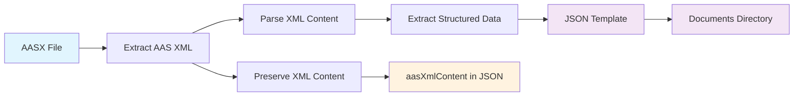
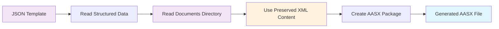
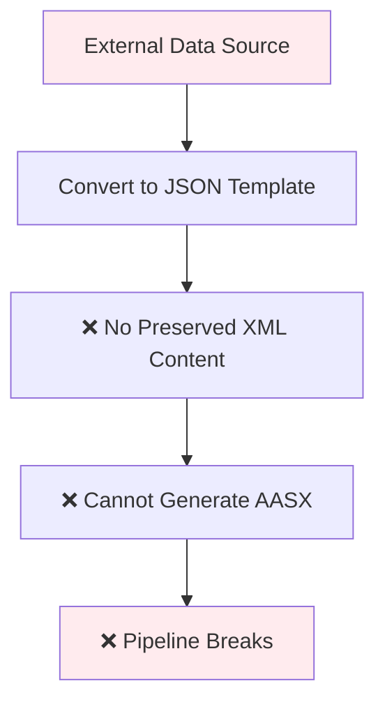
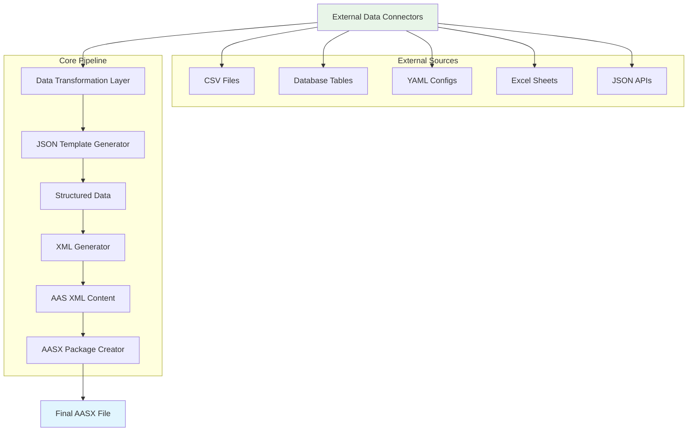
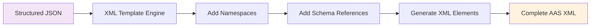
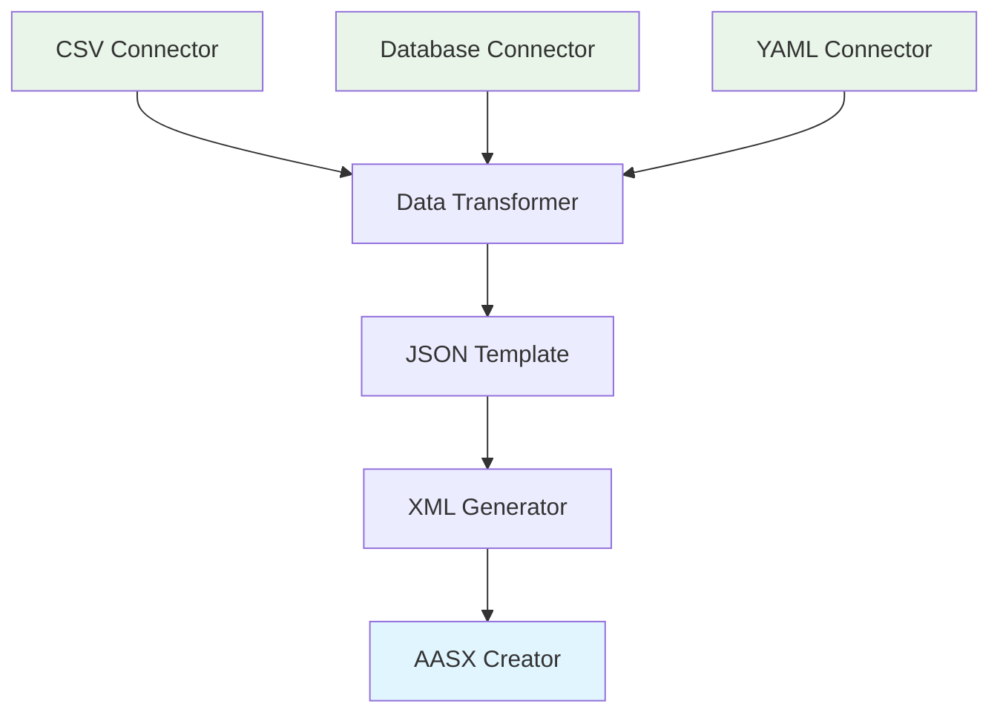
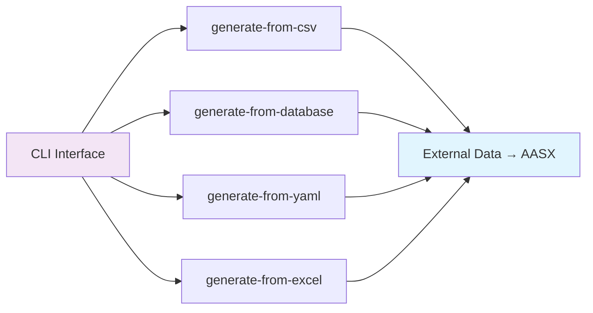
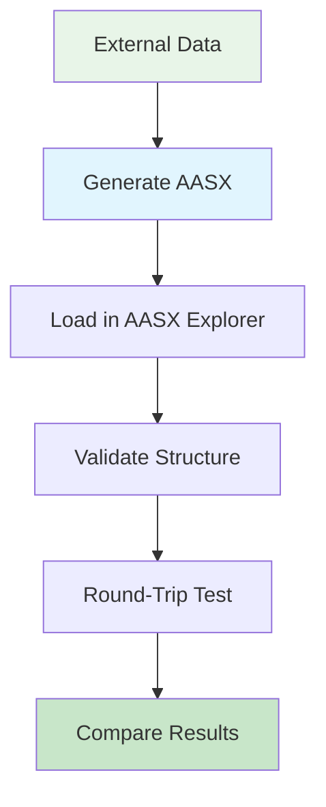

# External Data to AASX Conversion

## Overview

This document outlines the analysis and implementation approach for converting external data sources (CSV, databases, YAML, etc.) directly into AASX files through our structured data pipeline.

## Key Discovery

**✅ External data → AASX conversion is FULLY POSSIBLE!**

Our analysis revealed that all actual AAS data content is captured in our structured JSON format. The "missing" XML elements are just XML structure and formatting, not the actual data.

## Current Pipeline Analysis

### Current Forward Processing (AASX → JSON + Documents)


### Current Backward Processing (JSON + Documents → AASX)


## Problem with Current Approach

### Limitation: XML Preservation Dependency


**Issue**: Current backward conversion relies on preserved XML content from the original AASX file. External data sources don't have this preserved XML, breaking the pipeline.

## Analysis Results

### XML vs Structured Data Comparison
We analyzed the XML content against our structured data using `scripts/analyze_xml_vs_structured.py`:

| Metric | XML Elements | Structured Keys | Difference |
|--------|-------------|-----------------|------------|
| **Total Elements** | 639 | 164 | 475 "missing" |
| **Attributes** | 46 | - | 46 "missing" |
| **Text Values** | 216 | - | 216 "missing" |

### What's Actually "Missing"
The "missing" 639 elements are **NOT actual data** but XML structure:

- **XML Namespace Prefixes**: `{http://www.admin-shell.io/aas/1/0}`
- **XML Schema References**: `schemaLocation` attributes
- **XML Structural Elements**: Tag names and hierarchy
- **XML Attributes**: `@type`, `@idType`, `@lang`

### What's Fully Captured
**ALL actual AAS data content** is in our structured format:
- ✅ Assets and their properties
- ✅ Submodels and submodel elements
- ✅ Properties with values and types
- ✅ Concept descriptions
- ✅ Relationships and references
- ✅ Embedded files metadata

## Solution: Dynamic XML Generation

### Proposed Pipeline


### Implementation Architecture


## Implementation Steps

### Phase 1: XML Generation Engine


**Tasks:**
1. Create XML generation functions in `AasProcessor.cs`
2. Add standard AAS XML boilerplate (namespaces, schemas)
3. Map structured data to XML elements
4. Handle XML attributes and text content

### Phase 2: External Data Connectors


**Tasks:**
1. Create data connector interfaces
2. Implement CSV → JSON transformation
3. Implement database → JSON transformation
4. Implement YAML → JSON transformation
5. Add validation and error handling

### Phase 3: Enhanced CLI Commands


**New Commands:**
- `generate-from-csv <csv-file> <output-aasx>`
- `generate-from-database <connection-string> <query> <output-aasx>`
- `generate-from-yaml <yaml-file> <output-aasx>`
- `generate-from-excel <excel-file> <sheet-name> <output-aasx>`

## Technical Details

### XML Generation Requirements
```xml
<!-- Standard AAS XML Structure -->
<?xml version="1.0"?>
<aas:aasenv xmlns:xsi="http://www.w3.org/2001/XMLSchema-instance" 
            xmlns:IEC61360="http://www.admin-shell.io/IEC61360/1/0" 
            xsi:schemaLocation="http://www.admin-shell.io/aas/1/0 AAS.xsd 
                                http://www.admin-shell.io/IEC61360/1/0 IEC61360.xsd" 
            xmlns:aas="http://www.admin-shell.io/aas/1/0">
  <!-- Generated content from structured data -->
</aas:aasenv>
```

### Structured Data Mapping
```json
{
  "assets": [
    {
      "idShort": "Motor1",
      "identification": "http://example.com/assets/motor1",
      "kind": "Instance"
    }
  ],
  "submodels": [
    {
      "idShort": "TechnicalData",
      "identification": "http://example.com/submodels/tech",
      "submodelElements": [
        {
          "property": {
            "idShort": "MaxSpeed",
            "valueType": "integer",
            "value": "5000"
          }
        }
      ]
    }
  ]
}
```

## Benefits of This Approach

### ✅ Advantages
1. **True External Data Support**: Convert any data source to AASX
2. **No XML Preservation Dependency**: Generate XML dynamically
3. **Flexible Data Transformation**: Support multiple input formats
4. **Standard Compliant**: Generate valid AAS XML
5. **Extensible**: Easy to add new data connectors

### 🔄 Round-Trip Compatibility


## Testing Strategy

### Validation Pipeline


**Test Cases:**
1. CSV with motor specifications → AASX
2. Database table with asset data → AASX
3. YAML configuration → AASX
4. Round-trip: AASX → JSON → AASX (should be identical)

## Files and Scripts

### Analysis Tools
- `scripts/analyze_xml_vs_structured.py` - Compare XML vs structured data
- `aas-processor/AasProcessor.cs` - Core processing logic
- `aas-processor/Program.cs` - CLI interface

### Documentation
- `docs/EXTERNAL_DATA_TO_AASX_CONVERSION.md` - This document
- `docs/AAS_PROCESSOR.md` - Processor documentation
- `docs/AASX_DATA_ARCHITECTURE.md` - Architecture overview

## Next Steps

### Immediate Actions
1. ✅ **Analysis Complete** - Verified external data → AASX is possible
2. 🔄 **Implement XML Generation** - Replace preserved XML with dynamic generation
3. 🔄 **Add External Connectors** - Support CSV, database, YAML inputs
4. 🔄 **Enhance CLI** - Add new generation commands
5. 🔄 **Testing** - Validate with real external data sources

### Future Enhancements
- Web interface for data upload and conversion
- Template system for different AAS types
- Batch processing for multiple files
- Integration with existing webapp

## Conclusion

The analysis confirms that **external data → AASX conversion is not only possible but straightforward** with our current architecture. The key insight is that we need to generate XML dynamically from structured data rather than relying on preserved XML content.

This approach will unlock the full potential of our AAS processing pipeline, enabling conversion from any data source to standard-compliant AASX files.

---

*Last Updated: July 21, 2024*
*Analysis Tool: `scripts/analyze_xml_vs_structured.py`*
*Test Data: `output/round_trip_test/converted.json`* 