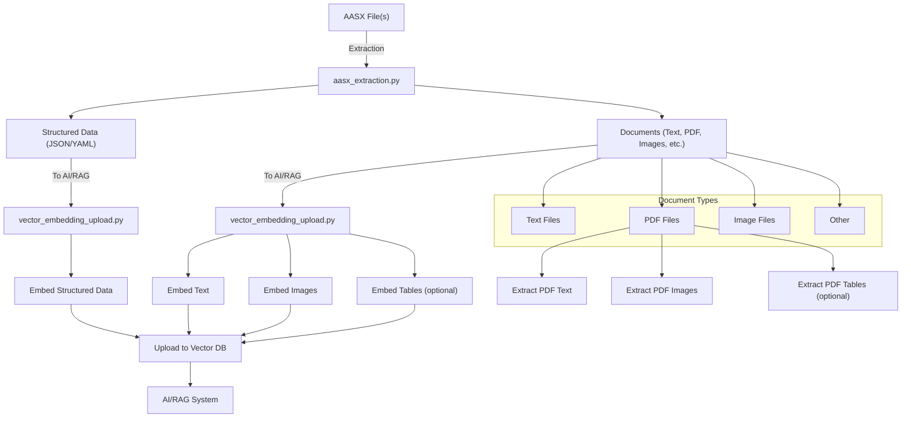

# Vision Plan: AASX ETL Pipeline for AI/RAG

## Architecture Flowchart

---

## Vision Statement

The AASX ETL Pipeline aims to provide a robust, modular, and extensible framework for extracting, transforming, and leveraging data and documents from AASX files for advanced AI and Retrieval-Augmented Generation (RAG) applications. This pipeline bridges the gap between industrial data standards and modern AI-driven knowledge systems.

---

## Pipeline Overview

### 1. Extraction (`aasx_extraction.py`)
- **Purpose:** Orchestrates the extraction of both structured data (JSON, YAML) and unstructured documents (text, PDF, images, etc.) from AASX files using the aas-processor.
- **Output:**
  - Structured data files (JSON, YAML)
  - Documents directory containing all referenced or embedded files

### 2. Document Type Handling
- **Text Files:** Directly processed for embedding.
- **PDF Files:**
  - Extract text for semantic embedding
  - Extract images (figures, diagrams) for vision embedding
  - Optionally extract tables for specialized processing
- **Image Files:** Embedded using vision models.
- **Other Files:** Handled as needed or flagged for future support.

### 3. Embedding & Upload (`vector_embedding_upload.py`)
- **Purpose:**
  - Generates vector embeddings for all structured data and document content using appropriate models (text, vision, multimodal).
  - Uploads embeddings and metadata to a vector database (e.g., Qdrant, Pinecone) for semantic search and retrieval.
- **Batch Processing:** Supports efficient batch embedding and upload for scalability.

### 4. AI/RAG Integration
- **Purpose:**
  - Enables advanced retrieval and generation workflows by leveraging the vector database.
  - Supports semantic search, context retrieval, and knowledge augmentation for LLMs and other AI systems.

### 5. Generation (`aasx_generator.py`)
- **Purpose:**
  - Reconstructs AASX files from structured data and documents, supporting round-trip workflows and data integrity.

---

## Modular Python Files

- **aasx_extraction.py:** Handles all extraction logic and orchestration.
- **vector_embedding_upload.py:** Handles embedding generation and upload to the vector database.
- **aasx_generator.py:** Handles reconstruction/generation of AASX files from extracted data and documents.

---

## Best Practices & Extensibility

- **Separation of Concerns:** Each module has a clear, single responsibility.
- **Extensible Design:** Easy to add support for new document types, embedding models, or vector databases.
- **Error Handling:** Robust error handling and logging at each stage.
- **Batch Processing:** Designed for scalability and efficiency.
- **Metadata Linking:** Maintain strong links between data, documents, and their embeddings for traceability.
- **Testing:** Comprehensive unit and integration tests for each module.

---

## Future Directions
- **Support for more file types (e.g., audio, video, CAD).**
- **Advanced table extraction and embedding from PDFs.**
- **Integration with more AI models and vector DBs.**
- **Automated monitoring and reporting for pipeline health.**

---

## Conclusion

This vision plan provides a clear, modular, and future-proof roadmap for leveraging AASX data and documents in AI/RAG systems, ensuring both industrial compliance and state-of-the-art AI capabilities. 